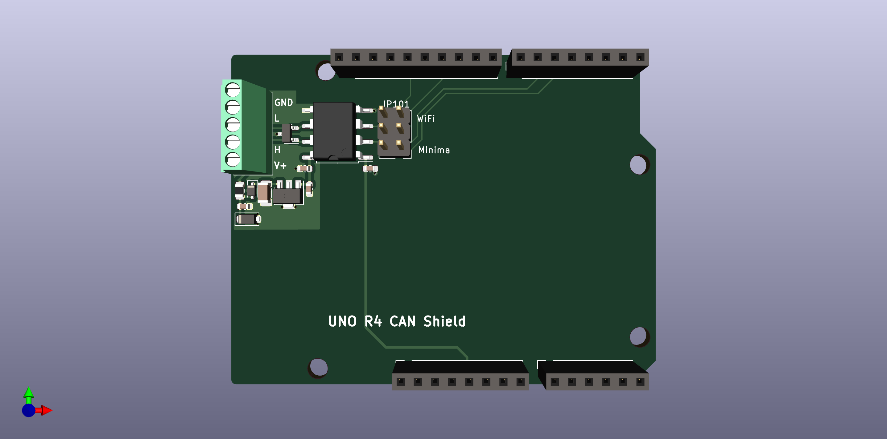

# uno-r4-can

A prototype shield that provides an isolated CAN transceiver for use with the Arduino Uno R4 Wifi or Minima.

The jumper selects between the diffent pins used for CAN on the Minima and Wifi versions.
